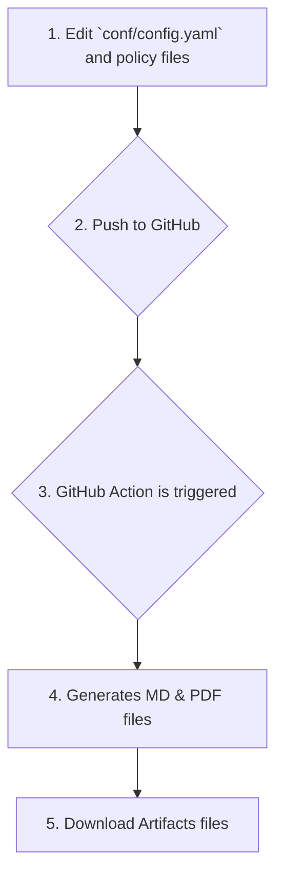

# PolicyComposer: A Company Policy Document Engine

This repository provides a complete build system for creating, managing, and versioning company policies. It uses a powerful [Jinja2](https://jinja.palletsprojects.com/en/stable/) templating engine, a Python build script, and GitHub Actions to automatically generate versioned Markdown and professional PDF documents.

## Table of Contents
- [Why Use PolicyComposer?](#why-use-policycomposer)
- [Workflow Overview](#workflow-overview)
- [Quick Start](#quick-start)
- [Detailed User Guide](/docs/UserGuide.md)
- [Configuration Details (`conf/config.yaml`)](#configuration-overview)
- [How Version History Works](#how-version-history-works)
- [Template Documentation](#template-documentation)
- [Attribution & License](#attribution--license)

## Why Use PolicyComposer?
Managing company policies in traditional word processors can be a nightmare. PolicyComposer solves this by treating your policies like code.

-   **Single Source of Truth:** Manage all company variables (names, roles, emails) in one `config.yaml` file. Update it once, and it populates across all documents.
-   **Powerful Automation:** A robust GitHub Action automatically builds and versions your policies every time you push a change. No manual document formatting required.
-   **Built-in Version Control:** Leverage Git for a full audit trail. The system automatically generates version history tables within your documents for both "hotfixes" and "global releases."
-   **Customizable & Professional:** Use Pandoc and LaTeX to generate clean, professional PDFs. Customize fonts, titles, and authors easily.
-   **Secure by Design:** Designed to be used in a private repository, ensuring your sensitive company information remains confidential.

## Workflow Overview

## How to Use This Project

### Quick Start
For details on how to get this up and running, visit the [**User Guide**](docs/UserGuide..md) documentation. 
1.  **Create a new PRIVATE repository** on GitHub from this template.
2.  Clone your new repository to your local machine.
3.  Copy `conf/config-example.yaml` to `conf/config.yaml` and fill in your company's details.
4.  Push your changes to the `main` branch.
5.  Go to the **Actions** tab in your repository, find the completed workflow, and download your documents from the **Artifacts** section.

---

## **Template Documentation**
The markdown documents are formatted to be updated based on changes to the \`conf/config.yaml\` file. 

- **Templating:** For a detailed guide on using Jinja2 logic (if, for, etc.), see [docs/templating_guide.md](docs/templating_guide.md).
- **Config Validation:** This project includes a powerful validation script to check your `config.yaml` for correctness, consistency, and completeness before you commit your changes. It can catch typos in variable names used in your templates, structural errors in your vendor list, and other common issues. See docs/CONFIG_VALIDATION.md for full details.

## Attribution & License 
### AI-Assisted Development
This project has been developed with the assistance of AI coding tools. Features, documentation, and workflow optimizations have been implemented with support from:
-   **Google's Gemini Code Assist:** For architectural suggestions, code generation, and documentation improvements.
-   **GitHub CoPilot:** For real-time code completion and suggestions.

### Attribution
The policy templates in the `policies/` directory were originally based on the Catalyze HIPAA Compliance Policies by Catalyze, Inc. which [were originally available on GitHub](https://github.com/catalyzeio/policies/) -- and [apparently live on in forks](https://github.com/globerhofer/HIPAA-policies). These are licensed under a  Creative Commons Attribution-ShareAlike 4.0 International License.

### License
This project uses a hybrid licensing model:

- **The Software** (all .py, .yml, .github/workflows files) is licensed under the MIT License.
- **The Content** (the .md policy files) is licensed under the CC BY-SA 4.0 License, as it is a derivative of the original Catalyze policies.
-   **The Software** (all `.py`, `.yml`, `.github/workflows` files) is licensed under the MIT License.
-   **The Content** (the `.md` policy files) is licensed under the CC BY-SA 4.0 License, as it is a derivative of the original Catalyze policies.

See the [LICENSE.md](LICENSE.md) file for full details.
